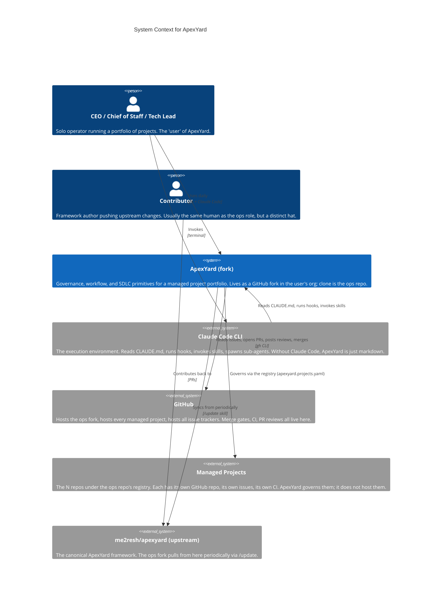

# System Context — ApexYard

> **C4 Level 1** — how ApexYard fits into the day of a CEO / Chief-of-Staff / Tech Lead managing a portfolio of projects.

## Diagram

## How to read this

- **The user is the ops role.** Whoever runs Claude Code in the ops fork. In a solo setup that's one person wearing many hats; in a team setup it's a small group.
- **ApexYard itself is a collection of docs, hooks, skills, and registries** — it doesn't "run" anywhere standalone. It's interpreted by Claude Code. Everything ApexYard enforces, it enforces through Claude Code hooks or through human-read rules in CLAUDE.md.
- **GitHub is the source of truth** for tracker state, PR state, merge state. ApexYard never holds state that should live in GitHub — the approval markers in `.claude/session/reviews/` are session-local and gitignored.
- **Managed projects are first-class external systems.** ApexYard does not ingest their code; it points at them via the registry. Their own git history, CI, and issues stay in their own repos.

## Why these relationships matter

- `ops → apex` **via Claude Code** — the user never edits ApexYard files through some proprietary UI; they use the CLI, which means shell tooling, git, and gh remain the authoritative interface.
- `apex → github` — the single integration point. No Jira, no Linear, no Notion. If you want ApexYard to feel different, the work lives in adding GitHub integrations, not in replacing GitHub.
- `apex → upstream` **via /update** — the fork-sync path. Without `/update`, forks silently drift (PRD-0002 problem #1). The SessionStart drift banner ensures the user knows when to invoke it.

## What this diagram does NOT show

- Internal structure of ApexYard (hooks, skills, agents, rules, workflows) — that's the L2 container diagram in `apexyard-container.md`.
- Deployment topology — ApexYard doesn't "deploy." It lives in the user's local clone and on GitHub.
- The flow of a specific feature from idea to production — that's the SDLC, documented in `workflows/sdlc.md` as a sequence, not a context diagram.

## Maintenance

Should change only when a major new external dependency enters or leaves. Candidates:

- If ApexYard ever gains a first-class Linear / Jira integration → add those as external systems
- If the managed-project model is replaced or extended (unlikely) → re-draw the boundary
- If upstream naming / sync model changes — edit accordingly

Target: no more than one or two updates per year.
